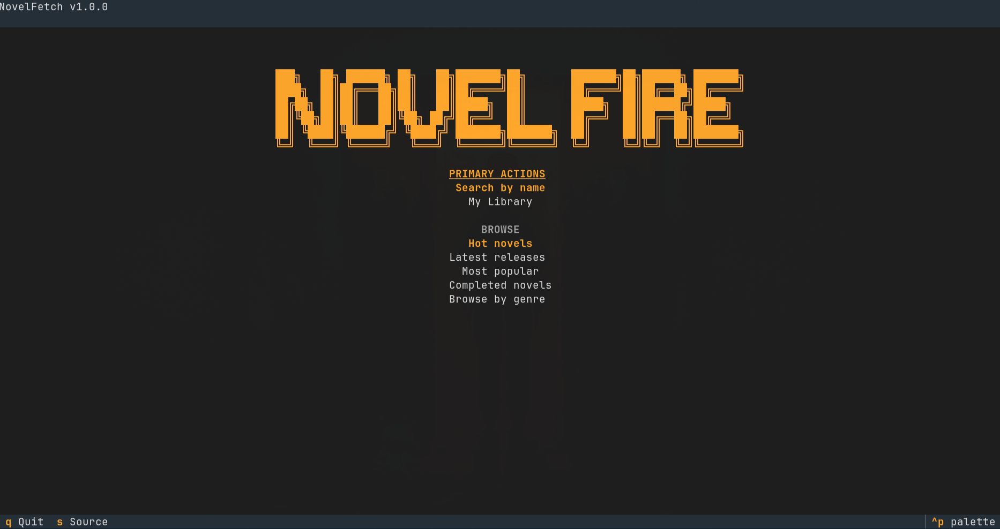

# NovelFetch

A terminal + mobile novel reader and downloader with a pluggable scraper architecture. Browse, search, download, translate, and read chapters offline. Ships two frontends over one shared framework: a **Textual TUI** for the terminal and a **KivyMD GUI** for desktop + Android.

```
     ███╗   ██╗ ██████╗ ██╗   ██╗███████╗██╗     ██████╗ ██╗███╗   ██╗
     ████╗  ██║██╔═══██╗██║   ██║██╔════╝██║     ██╔══██╗██║████╗  ██║
     ██╔██╗ ██║██║   ██║██║   ██║█████╗  ██║     ██████╔╝██║██╔██╗ ██║
     ██║╚██╗██║██║   ██║╚██╗ ██╔╝██╔══╝  ██║     ██╔══██╗██║██║╚██╗██║
     ██║ ╚████║╚██████╔╝ ╚████╔╝ ███████╗███████╗██████╔╝██║██║ ╚████║
     ╚═╝  ╚═══╝ ╚═════╝   ╚═══╝  ╚══════╝╚══════╝╚═════╝ ╚═╝╚═╝  ╚═══╝
     ════════════════════════════════════════════════════════════════════
                          TUI + GUI Novel Reader v2
```

<p align="center">
  
</p>


---

## Features

- **Search** — real-time search with 750ms debounce; paginate with `n`/`p`
- **Browse** — hot, latest, most popular, completed, and dozens of genres per source
- **My Library** — browse locally downloaded novels, resume reading, delete
- **Reader** — next/prev (`n`/`p`), jump to chapter (`j`), download current (`d`)
- **Progress tracking** — auto-saves last chapter; ✓ marks read chapters
- **Download dialog** — All, Range, or Translated; progress bar with translation warning
- **Translation** — Google Translate (12 languages); Arabic RTL layout with shaped text
- **EPUB export** — generate EPUB files from downloaded chapters
- **Delete with safety** — double-press `x` to confirm deletion

Key bindings in the reader:

| Key | Action |
| ----- | -------- |
| `n` / `p` | Next / Prev chapter |
| `j` | Jump to chapter number |
| `d` | Download dialog (All / Range / Translated) |
| `t` | Translate to language |
| `r` | Revert to original text |
| `h` | Go to main menu |
| `q` | Back to chapter list |

---

## Two frontends, one core

- `main.py` — entry-point dispatcher: TUI on desktop, GUI on Android (`ANDROID_ARGUMENT`).
- `tui/` — **Textual TUI**: `main.py` (app), `main_menu.py`, `browse.py`, `reader.py`, `library.py`, `download.py`, `source_picker.py`, `shared.py`, `utils.py`, `novelfetch.tcss`.
- `gui/` — **KivyMD GUI** (desktop + Android): `main.py`, `screens/` (`main_screen`, `home_tab`, `search_tab`, `update`, `history`, `settings_tab`, `novel_list`, `chapter_list`, `reader`, `download_picker`, `download_dialog`, `source_picker`, `topbar`, `theme`, `app_settings`), `kv/` layout files, `data/` (icon, bundled Arabic font).
- `core/` — shared framework: `progress.py`, `translation.py`, `epub.py`, `downloader.py`, `http_client.py`, `library.py`, `utils.py` (source dispatch), `paths.py` (data-dir resolution for frozen/AppImage/Android).
- `sources/` — pluggable `Source` interface (`base.py`) and a `REGISTRY` of scrapers.
- `novels/` — downloaded chapters, per-novel `meta.json` / `cover.*`, `progress.json`, `tracking.json`.

## Pluggable sources

The `Source` abstraction (`sources/base.py:1`) defines browsing, search, chapter fetching, and cover resolution; implementations are registered in `sources/__init__.py:7`:

| Source | Browse lists | Genres | Notes |
|--------|-------------|--------|-------|
| **NovelFire** | 9 | 47 | Throttled paging (`PAGE_DELAY = 0.4`) — novelfire.net returns 429 on burst paging |
| **NovelPhoenix** | 9 | 55 | Condensed 79-column ASCII banner so it doesn't wrap |
| **RoyalRoad** | 8 (hot, popular, latest, newest, completed, rising stars, ongoing, more) | 13 | AJAX-free chapter table |
| **ScribbleHub** | 4 (hot, latest, popular, completed) | 25 | Cloudflare-aware; lazy `curl_cffi` with httpx fallback (p4a-safe) |
| **WuxiaSpot** | 7 | 48 | AJAX pagination (`fy.php`); search marked unreliable |

New sources implement the same interface and register a key — no frontend changes needed.

---

## Installation

### Quick start

```bash
git clone https://github.com/Momokh99/NovelFetch.git
cd NovelFetch
make setup          # creates both environments (TUI + GUI)
make pre-commit-install
```

### Running

```bash
make run-tui        # Textual TUI (terminal)
make run-kivy       # KivyMD GUI (desktop)
```

### What `make setup` does

The project uses two separate virtual environments:

| Environment | Purpose | Created by |
|-------------|---------|------------|
| `myenv/` | TUI + code quality tools (Ruff, mypy, Pyright) | `make setup-tui` |
| `android_env/` | KivyMD GUI (desktop + Android) | `make setup-android` |

Dependencies are split across `pyproject.toml` optional groups:
- **Core**: `httpx`, `beautifulsoup4`, `lxml`, `deep-translator`, `ebooklib`
- **TUI**: `textual`, `curl_cffi`
- **GUI**: `kivy`, `kivymd`, `arabic-reshaper`, `python-bidi`

---

## How It Works

**Architecture:**

The package layout is described once, in [Two frontends, one core](#two-frontends-one-core) above — `main.py` dispatches to either `tui/` or `gui/`, both of which sit on `core/` and `sources/`.

The GUI is the richer frontend: a 5-tab `MDNavigationBar` (Home / Search / Updates / History / Settings) plus per-novel browse flow. Settings persist to `app_settings.json`; update checks reconcile against `update_results.json`. Downloads run concurrently (`core/downloader.py` caps at 4) with a live progress bar.

---

## Android packaging

`buildozer.spec` builds a debug APK with python-for-android:

- arm64-v8a, API 34 (min 21), NDK 25b
- p4a pinned to `v2026.05.09` (avoids nightly-master breakage with pip ≥ 26)
- CI (`release.yml`) builds and publishes the APK with every tagged release

```bash
make android-debug    # build debug APK
make android-deploy   # deploy to connected device
```

---

## Roadmap

- [x] TUI mode (Textual interface)
- [x] GUI mode (KivyMD desktop + Android)
- [x] Resume from last chapter (progress.json)
- [x] Search with auto-type and pagination
- [x] Translation (Google Translate, 12 languages, RTL support)
- [x] Multi-source architecture (NovelFire, NovelPhoenix, RoyalRoad, ScribbleHub, WuxiaSpot)
- [x] Download dialog (All, Range, Translated)
- [x] Offline reading mode
- [x] Reading history across sessions
- [x] EPUB export
- [x] APK build via Buildozer
- [ ] Better text formatting (italics, line breaks, spacing)
- [ ] Search filters (genre, status, rating)
- [ ] Adding to AUR — blocked: AUR account registration disabled upstream; packages ready to push once sign-ups reopen

---

## Development

### Quick Start

```bash
# One-time setup
make setup
make pre-commit-install

# Daily development
make run-tui            # Run the TUI app
make run-kivy           # Run the KivyMD GUI app
make lint               # Check code quality
make format             # Auto-format code
```

### Available Commands

| Command | Description |
|---------|-------------|
| `make setup` | Create both venvs and install all dependencies |
| `make run-tui` | Run TUI app (myenv) |
| `make run-kivy` | Run KivyMD GUI app (android_env) |
| `make lint` | Run Ruff + mypy + Pyright |
| `make lint-fix` | Auto-fix lint issues |
| `make format` | Auto-format code (ruff format + import sorting) |
| `make format-check` | Check formatting without modifying |
| `make android-debug` | Build debug APK |
| `make android-release` | Build release APK |
| `make android-deploy` | Deploy to connected device |
| `make android-logcat` | Show device logcat |
| `make android-clean` | Clean buildozer build artifacts |
| `make pre-commit-run` | Run pre-commit on all files |
| `make clean` | Remove build artifacts and caches |
| `make bump-release VERSION=x.y.z` | Bump version in pyproject.toml + buildozer.spec |

### Development Tools

- **Linting**: Ruff locally via `make lint`; CI keeps a flake8 syntax/undefined-name gate
- **Type Checking**: Mypy + Pyright
- **Pre-commit**: Auto-format on commit

---

## Disclaimer

This tool scrapes publicly available content for personal use only. Novels belong to their authors and translators. Do not redistribute downloaded content. Support the creators if you enjoy their work.